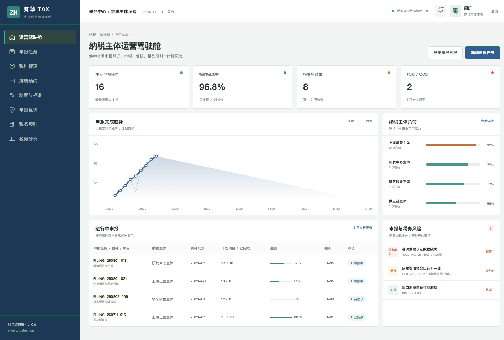
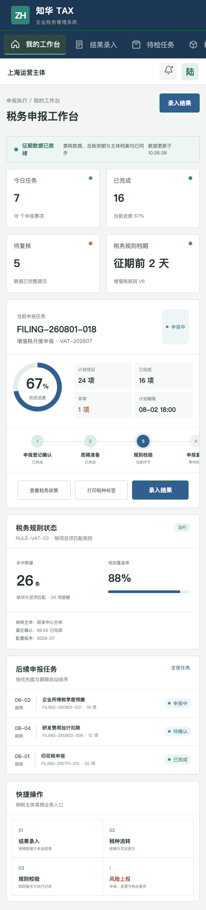

# ZhuaTech TAX｜企业税务管理系统

[](LICENSE) [](backend/) [](frontend/) [](https://www.zhuatech.cn/)

ZhuaTech TAX 将多主体、税种申报、底稿、规则校验、税务风险和台账记录集中到一个工作空间。项目由知华科技（上海如静知华信息科技有限公司）维护，官网：[https://www.zhuatech.cn/](https://www.zhuatech.cn/)。

## 一张驾驶舱掌握征期进度



管理端可查看主体申报进度、税务规则提醒、底稿复核、临期任务和税会差异；税务会计 H5 端适合处理申报准备、规则校验、结果录入与风险上报。



## 适用流程

1. 维护纳税主体、税种、征期与责任人。
2. 建立申报任务并准备底稿和凭证索引。
3. 执行销项进项、税会一致性、研发费用等规则校验。
4. 完成复核、申报、回执登记与台账归档。
5. 跟踪发票、申报差异、单证时限和风险事项。

## 技术目录

```text
zhuatech-tax/
├── backend/   Java 21 / Spring Boot / Security / JPA / Flyway
├── frontend/  Vue 3 / Pinia / Router / Axios / Vite
├── docs/      架构、接口、数据库和界面图片
└── compose.yaml
```

Java 根包：`cn.zhuatech.tax`；业务数据库：`zhuatech_tax`；生产数据库为 MySQL 8，测试使用 H2。

## 快速体验

```bash
cd frontend
npm install
npm run dev:demo
```

地址 `http://localhost:5173`，主管端 `planner / Demo@2026`，税务会计端 `operator / Demo@2026`。完整部署请复制 `.env.example`、修改数据库密码及 `JWT_SECRET`，然后执行 `docker compose up --build`。仓库内主体、申报、发票、金额和指标全部为虚构演示数据。

## 个人学习许可

本工程仅允许个人、非商业性的学习、研究与技术交流，**不得商用**。企业内部使用、生产部署、SaaS、客户项目交付、收费培训、咨询实施及品牌替换，均须事先取得上海如静知华信息科技有限公司书面授权。请以 [LICENSE](LICENSE) 为准。

需要税务系统深度开发、数据集成、私有化部署或商业授权，可访问[知华科技官网](https://www.zhuatech.cn/)并扫码咨询：

| 微信咨询 | 微信咨询 |
| --- | --- |
|  |  |

SEO：企业税务管理系统源码、税务申报管理、税务风险管理、Java TAX、Vue 税务系统、知华科技。

## 税务申报准备度

新增 `POST /api/tax/insights/filing-readiness`，检查台账核对、发票匹配、申报附表、未决风险、截止时间和缴税资金，输出 `READY`、`REMEDIATE` 或 `BLOCK`。
